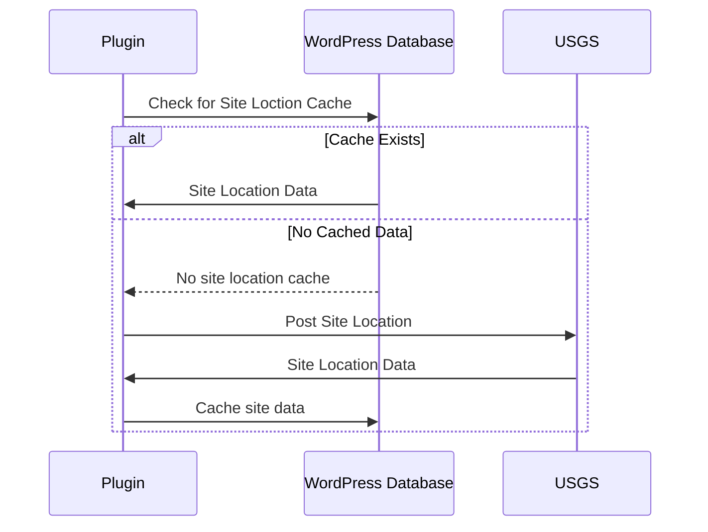

# Architecture

## Site Location Cache Sequence Diagram

Each site location is cached as a transient in the WordPress database. Below is a sequence diagram of the caching process.

```mermaid
sequenceDiagram
    participant Plugin
    participant wpdb as WordPress Database
    participant USGS
Plugin->>wpdb: Check for Site Loction Cache
alt Cache Exists
	wpdb->>Plugin: Site Location Data
else No Cached Data
	wpdb-->>Plugin: No site location cache
	Plugin->>USGS: Post Site Location
	USGS->>Plugin: Site Location Data
	Plugin->>wpdb: Cache site data
end
```
