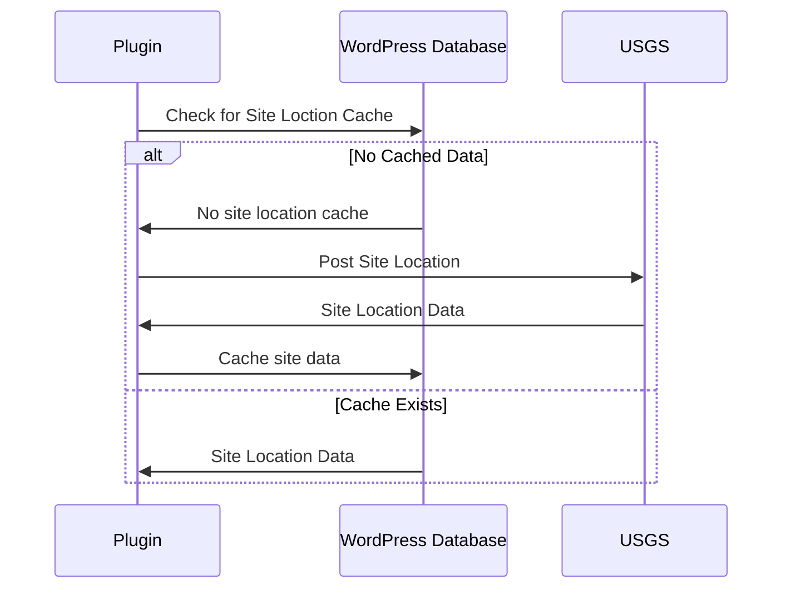

# Architecture

## Site Location Cache Sequence Diagram

```mermaid
sequenceDiagram
    participant Plugin
    participant wpdb as WordPress Database
    participant USGS
Plugin->>wpdb: Check for Site Loction Cache
alt No Cached Data
	wpdb->>Plugin: No site location cache
	Plugin->>USGS: Post Site Location
	USGS->>Plugin: Site Location Data
	Plugin->>wpdb: Cache site data
else Cache Exists
	wpdb->>Plugin: Site Location Data
end
```
